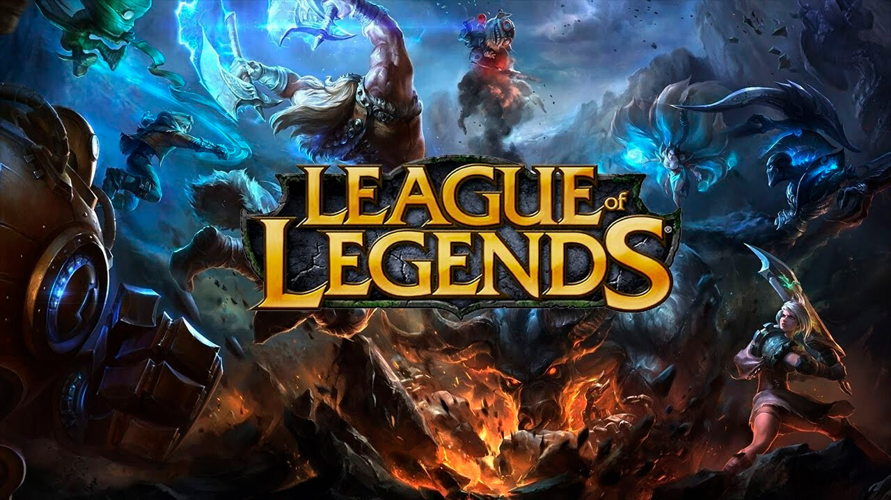
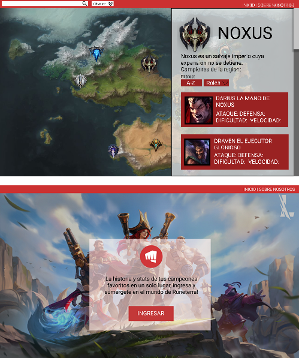

# Data Lovers
### By Susana Martínez y Karen Baron

---

## Índice

* [1. Introducción](#INTRODUCCIÓN)
* [2. Resumen del proyecto](#2-resumen-del-proyecto)
* [3. Objetivos de aprendizaje](#3-objetivos-de-aprendizaje)
* [4. Como se resuelve la problemática del usuario](#4-como-se-resuelve-la-problemática-del-usuario)
* [5. Checklist](#5-checklist)

----

## 1. Introducción:

## ¿Porqué escogimos este proyecto?
Escogimos el proyecto "Data-Lovers" ya que nos interesaba crear un tipo de enciclopedia de campeones respecto a un videojuego en el que ambas integrantes tenemos interés, y este es "League of Legends".

-------------

## 2. Resumen del proyecto:

### 1. Proceso de diseño:

Nuestro primer pensamiento a la hora de empezar a trabajar en el proyecto fueron nuestras historias de usuario. Pensamos que deberíamos hacer primero y lo primero que se nos vino a la mente fue crear unos diseños básicos en figma de cómo podría ser una pagina que muestre los campeones, pensando en pedir feedback a los usuarios de que pensaban de la página, porque la usarían y que creen que deberíamos implementar. Así quedaron los dos primeros diseños:

### - Diseño #1

Este primer diseño se basaba en usar el mapa de la tierra donde pasan los hechos del juego para que los usuarios se familiaricen con los diferentes lugares de runeterra, en este mapa podían elegir entre las diferentes regiones y ver los campeones que viven en estas, al dar click en el campeón se desplegaría una parte de su historia, su título y sus stats.

---

### - Diseño #2

En este segundo diseño el usuario entraría con su cuenta, automáticamente se mostrarían todos los campeones, tendría dos filtros, uno por rol y otro por A-Z y una barra de búsqueda. Si el usuario le daba click mostraría su nombre, titulo y historia.

---

## Historias de usuario:
Teniendo en claro que nuestro público objetivo serían los jugadores de LOL (que son jóvenes de los 13 a los 25 años) buscamos a 4 personas, dos que nunca hayan jugado y dos que sean jugadores activos, les presentamos los bocetos para así recibir su respectivo feedback, haciéndoles preguntas como ¿Por qué usarían nuestra página? y ¿cómo la utilizarían?, dando como resultado las siguientes historias de usuario:

### A. Historia de usuario No. 1 👩‍🦰:
- "Como usuaria que apenas se está adentrando al mundo del juego, no me parece buena idea utilizar el mapa de las regiones ya que no seria capaz de identificar los campeones que quiero ver, me parece una mejor idea que con un solo click pueda ver a todos los campeones en una lista, ya que para mi es mas importante saber de los campeones antes de meterme en el juego."

### B. Historia de usuario No. 2 👨‍🦱:
- "Apenas voy empezando en el juego, y me gustaría que hubiera un botón o un filtro, que cuando le haga click me muestre los campeones más fuertes y los menos fuertes, ya que me ayudaría a escoger con que campeón ir cuando me inicie en el juego."

### C. Historia de usuario No. 3 👩‍🦱:
- "Me gusta la estética de mostrar todas las tarjetas de los campeones, pero me gustaría que cuando pase el mouse por encima se eleve la tarjeta y el nombre del campeón, y que además muestre un color a la hora de hacerlo. Siento que le daría un estilo más dinámico así."

### D. Historia de usuario No. 4 🧑:
- "Yo como usuario quisiera que la pagina tuviera una barra de busqueda, donde solo escriba el nombre del campeón y me salga su tarjeta."

---

## Diseño final:
A partir de lo anterior, establecimos tareas diarias y de sprint relacionados al desarrollo del código de nuestra pagina web, donde concluimos que deberíamos tener estos elementos como principales:
-	Mostrar las tarjetas de los campeones sin necesidad de iniciar sesión
-	Un filtro que muestre al campeón mas fuerte y el más débil
-	Las tarjetas se deben elevar y mostrar un color para más dinamismo
-	Implementar una barra de búsqueda para que los usuarios puedan buscar a su campeón favorito

Con lo anterior creamos este diseño de alta fidelidad según las necesidades de nuestros usuarios:

-------------

## 3. Objetivos de aprendizaje

Reflexiona y luego marca los objetivos que has llegado a entender y aplicar en tu proyecto. Piensa en eso al decidir tu estrategia de trabajo.

### HTML

- [X] **Uso de HTML semántico**

### CSS

- [x] **Uso de selectores de CSS**

- [x] **Modelo de caja (box model): borde, margen, padding**

- [x] **Uso de flexbox en CSS**

### Web APIs

- [x] **Uso de selectores del DOM**

- [x] **Manejo de eventos del DOM (listeners, propagación, delegación)**

- [x] **Manipulación dinámica del DOM**

### JavaScript

- [x] **Diferenciar entre tipos de datos primitivos y no primitivos**

- [x] **Arrays (arreglos)**

- [x] **Objetos (key, value)**

- [x] **Variables (declaración, asignación, ámbito)**

- [x] **Uso de condicionales (if-else, switch, operador ternario, lógica booleana)**

- [x] **Uso de bucles/ciclos (while, for, for..of)**

- [x] **Funciones (params, args, return)**

- [x] **Pruebas unitarias (unit tests)**

- [x] **Módulos de ECMAScript (ES Modules)**

- [x] **Uso de linter (ESLINT)**

- [x] **Uso de identificadores descriptivos (Nomenclatura y Semántica)**

- [ ] **Diferenciar entre expresiones (expressions) y sentencias (statements)**

### Control de Versiones (Git y GitHub)

- [x] **Git: Instalación y configuración**

- [x] **Git: Control de versiones con git (init, clone, add, commit, status, push, pull, remote)**

- [x] **Git: Integración de cambios entre ramas (branch, checkout, fetch, merge, reset, rebase, tag)**

- [x] **GitHub: Creación de cuenta y repos, configuración de llaves SSH**

- [ ] **GitHub: Despliegue con GitHub Pages**

- [ ] **GitHub: Colaboración en Github (branches | forks | pull requests | code review | tags)**

### user-centricity

- [x] **Diseñar un producto o servicio poniendo a la usuaria en el centro**

### product-design

- [x] **Crear prototipos de alta fidelidad que incluyan interacciones**

- [x] **Seguir los principios básicos de diseño visual**

### research

- [ ] **Planear y ejecutar testeos de usabilidad de prototipos en distintos niveles de fidelidad**

-------------

## 4. Como se resuelve la problemática del usuario:
Nuestra página web soluciona los problemas planteados en las historias de usuario, como son:

- A. El que no se requiera de inicio de sesión para descubrir a los campeones (champions) del videojuego "League of Legends".
- B. El poder visualizar a todos los campeones y sus stats, identificando así a los campeones más fuertes, con mayores niveles de vida o defensa, entre otros.
- C. El poder reconocer a los campeones dentro de cada uno de los roles que cumplen en el videojuego.
- D. La existencia de una barra de busqueda que permita a los jugadores con mayores conocimientos dentro del videojuego, localizar a los campeones por su nombre, junto con su historia (Lore).
- E. La elevación de la card del campeón al que se esté indicando con el mouse, para así lograr su ubicación de forma sencilla.